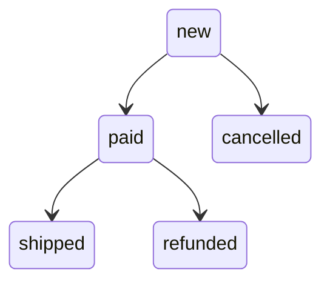

# tsukuyomi

Status transitions for any domain entity, done safely.

Orders, payments, applications, moderation tickets: every backend has entities with a `status` column and rules about
which status can follow which. People usually spread those rules across services and write the
`UPDATE ... WHERE status IN (...)` by hand. tsukuyomi keeps the rules in one graph and applies each transition atomically.
If two requests race on the same entity, only one wins and the other gets `ErrConflict`.

- One graph per entity type. The state is any `comparable` type: a string enum, an int, a custom type.
- Atomic compare-and-swap in storage, with no locks in the machine.
- Guards to veto a transition, and hooks that run after a transition commits.
- A Postgres store that works with any table and runs inside your own transaction.
- Exports the graph as a Mermaid diagram for your docs.
- The core has zero dependencies.

```
go get github.com/dDan4a/tsukuyomi
```

## Example

```go
type OrderStatus string

const (
	New       OrderStatus = "new"
	Paid      OrderStatus = "paid"
	Shipped   OrderStatus = "shipped"
	Cancelled OrderStatus = "cancelled"
	Refunded  OrderStatus = "refunded"
)

var orders = tsukuyomi.New[int64, OrderStatus]().
	Allow(New, Paid, Cancelled).
	Allow(Paid, Shipped, Refunded).
	Guard(Paid, Refunded, notOlderThan30Days).
	OnEnter(Shipped, notifyCustomer)

func Ship(ctx context.Context, db *pgxpool.Pool, id int64) error {
	store := pgstore.New[int64, OrderStatus](db, pgstore.Table{Name: "orders", IDColumn: "id", StateColumn: "status"})
	return orders.Transition(ctx, store, id, Shipped)
}
```

`Transition` returns one of these errors:

| Error | Meaning |
|---|---|
| `ErrInvalidTransition` | The graph has no edge from the current state to the target state |
| `ErrConflict` | Someone changed the state between the read and the write |
| `ErrNotFound` | The entity does not exist |
| an error from your guard | A guard vetoed the transition |

## Transactions

`pgstore.New` accepts `*pgxpool.Pool`, `*pgx.Conn` or `pgx.Tx`. If you pass a transaction, the status change commits
together with your other writes: an outbox row, an audit log entry, a balance update.

Hooks run after the store's write. Inside a transaction that means *before your commit*. Use hooks for things that are
safe to repeat or to roll back, and use an outbox for side effects that must happen exactly once.

## Other storages

Implement two methods:

```go
type Store[ID, S comparable] interface {
	State(ctx context.Context, id ID) (S, error)
	CompareAndSwap(ctx context.Context, id ID, from, to S) (bool, error)
}
```

`tsukuyomi.NewMemoryStore` is provided for tests.

## Diagram

`orders.Mermaid()` renders:


